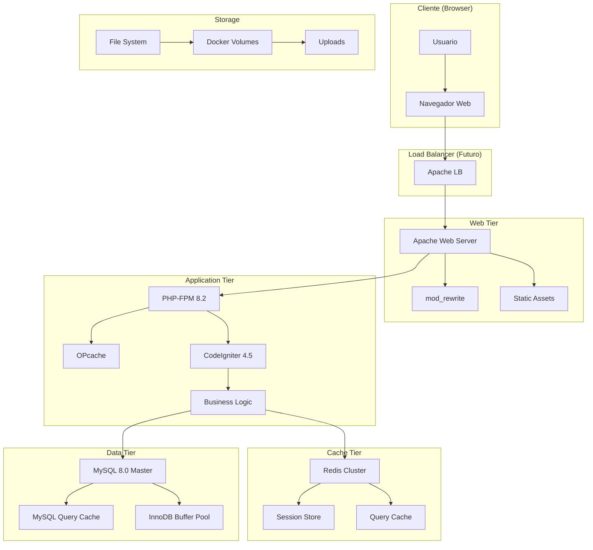

# 🏗️ Arquitectura del Sistema - Yagaruete Camp

> Documentación técnica de la arquitectura optimizada para alto rendimiento

## 📊 Vista General del Sistema



## 🎯 Principios de Diseño

### 1. **Separación de Responsabilidades**

- **Presentación**: Apache + Assets estáticos
- **Lógica de Negocio**: CodeIgniter + Controllers
- **Datos**: MySQL con optimizaciones
- **Cache**: Redis distribuido

### 2. **Escalabilidad Horizontal**

- Contenedores Docker independientes
- Cache distribuido preparado para clustering
- Base de datos optimizada para replicación

### 3. **Performance First**

- OPcache para bytecode PHP
- Query Cache para consultas frecuentes
- FastCGI buffering optimizado
- Static assets con cache headers

## 🏭 Capas de la Aplicación

### 🌐 Capa de Presentación

#### Apache Web Server

```apache
# Configuración optimizada para rendimiento
<VirtualHost *:80>
    DocumentRoot /var/www/html/public
    DirectoryIndex index.php

    # FastCGI optimizations
    fastcgi_buffer_size 128k;
    fastcgi_buffers 4 256k;
    fastcgi_busy_buffers_size 256k;

    # Static assets caching
    location ~* \.(css|js|jpg|jpeg|png|gif|ico|svg)$ {
        expires 1y;
        add_header Cache-Control "public, immutable";
    }
}
```

**Características:**

- ✅ **Reverse Proxy** para PHP-FPM
- ✅ **Static File Serving** optimizado
- ✅ **Gzip Compression** habilitado
- ✅ **FastCGI Caching** configurado
- ✅ **Security Headers** implementados

### ⚙️ Capa de Aplicación

#### PHP-FPM + CodeIgniter

```php
// Configuración de performance
[www]
pm = dynamic
pm.max_children = 50
pm.start_servers = 10
pm.min_spare_servers = 5
pm.max_spare_servers = 35
pm.max_requests = 500

// OPcache optimizado
opcache.enable=1
opcache.memory_consumption=256
opcache.interned_strings_buffer=16
opcache.max_accelerated_files=20000
opcache.validate_timestamps=0
```

**Componentes Principales:**

1. **Controllers** - Lógica de presentación

   - `HomeController` - Página principal optimizada
   - `ProductController` - Catálogo con cache
   - `CartController` - Carrito con Redis sessions

2. **Models** - Acceso a datos optimizado

   - `ProductModel` - Consultas con cache
   - `CategoryModel` - Navegación optimizada
   - `UserModel` - Autenticación eficiente

3. **Services** - Lógica de negocio
   - `CacheService` - Gestión inteligente de cache
   - `CartService` - Operaciones de carrito
   - `PaymentService` - Procesamiento de pagos

### 🗄️ Capa de Datos

#### MySQL 8.0 Optimizado

```sql
-- Configuración de rendimiento
SET GLOBAL query_cache_type = ON;
SET GLOBAL query_cache_size = 268435456; -- 256MB
SET GLOBAL innodb_buffer_pool_size = 536870912; -- 512MB

-- Índices estratégicos
CREATE INDEX idx_products_category ON products(category_id, status);
CREATE INDEX idx_products_price ON products(price, created_at);
CREATE INDEX idx_orders_user_date ON orders(user_id, created_at);
```

**Optimizaciones Implementadas:**

- ✅ **Query Cache** para consultas repetitivas
- ✅ **InnoDB Buffer Pool** aumentado
- ✅ **Índices Estratégicos** en tablas principales
- ✅ **Connection Pooling** optimizado
- ✅ **Prepared Statements** para seguridad

#### Esquema Optimizado

```sql
-- Tabla de productos con índices optimizados
CREATE TABLE products (
    id INT PRIMARY KEY AUTO_INCREMENT,
    name VARCHAR(255) NOT NULL,
    category_id INT NOT NULL,
    price DECIMAL(10,2) NOT NULL,
    stock INT NOT NULL DEFAULT 0,
    status ENUM('active', 'inactive') DEFAULT 'active',
    created_at TIMESTAMP DEFAULT CURRENT_TIMESTAMP,
    updated_at TIMESTAMP DEFAULT CURRENT_TIMESTAMP ON UPDATE CURRENT_TIMESTAMP,

    INDEX idx_category_status (category_id, status),
    INDEX idx_price_created (price, created_at),
    INDEX idx_stock_status (stock, status),
    FULLTEXT INDEX idx_search (name, description)
) ENGINE=InnoDB;
```

### 🚀 Capa de Cache

#### Redis 7.2 Cluster

```redis
# Configuración optimizada
maxmemory 512mb
maxmemory-policy allkeys-lru
save 900 1
save 300 10
save 60 10000

# Clustering preparation
cluster-enabled yes
cluster-config-file nodes-6379.conf
cluster-node-timeout 15000
```

**Estrategias de Cache:**

1. **Fragment Caching**

   ```php
   // Cache de productos por categoría
   $cacheKey = "products_category_{$categoryId}";
   if (!$products = cache()->get($cacheKey)) {
       $products = $this->productModel->getByCategory($categoryId);
       cache()->save($cacheKey, $products, 3600); // 1 hora
   }
   ```

2. **Session Storage**

   ```php
   // Configuración de sesiones en Redis
   $config['sessionDriver'] = 'CodeIgniter\Session\Handlers\RedisHandler';
   $config['sessionSavePath'] = 'tcp://redis:6379';
   ```

3. **Query Result Caching**

   ```php
   // Cache automático de consultas
   $query = $this->db->table('products')
                    ->where('status', 'active')
                    ->orderBy('created_at', 'DESC');

   $products = $query->get(10, 0, true); // true = usar cache
   ```

## 🔧 Patrones de Arquitectura

### 1. **Repository Pattern**

```php
interface ProductRepositoryInterface
{
    public function findById(int $id): ?Product;
    public function findByCategory(int $categoryId): array;
    public function search(string $term): array;
}

class CachedProductRepository implements ProductRepositoryInterface
{
    public function findById(int $id): ?Product
    {
        $cacheKey = "product_{$id}";

        if ($cached = cache()->get($cacheKey)) {
            return $cached;
        }

        $product = $this->baseRepository->findById($id);
        cache()->save($cacheKey, $product, 3600);

        return $product;
    }
}
```

### 2. **Service Layer Pattern**

```php
class CartService
{
    private $cartRepository;
    private $productRepository;
    private $cacheService;

    public function addItem(int $userId, int $productId, int $quantity): bool
    {
        // Validar stock con cache
        $product = $this->productRepository->findById($productId);

        if ($product->stock < $quantity) {
            throw new InsufficientStockException();
        }

        // Actualizar carrito
        $cart = $this->cartRepository->getByUser($userId);
        $cart->addItem($productId, $quantity);

        // Invalidar cache relacionado
        $this->cacheService->invalidateUserCart($userId);

        return $this->cartRepository->save($cart);
    }
}
```

### 3. **Factory Pattern para Cache**

```php
class CacheFactory
{
    public static function create(string $type): CacheInterface
    {
        switch ($type) {
            case 'redis':
                return new RedisCache([
                    'host' => 'redis',
                    'port' => 6379,
                    'prefix' => 'yaguarete_'
                ]);

            case 'file':
                return new FileCache([
                    'path' => WRITEPATH . 'cache',
                    'prefix' => 'yaguarete_'
                ]);

            default:
                throw new InvalidArgumentException("Cache type {$type} not supported");
        }
    }
}
```

## 📊 Métricas de Arquitectura

### Performance KPIs

| Componente  | Métrica         | Objetivo        | Monitoreo              |
| ----------- | --------------- | --------------- | ---------------------- |
| **Apache**  | Response Time   | < 50ms          | `apache status`        |
| **PHP-FPM** | Memory Usage    | < 128MB/process | `php-fpm status`       |
| **OPcache** | Hit Rate        | > 95%           | `opcache_get_status()` |
| **Redis**   | Hit Rate        | > 90%           | `INFO commandstats`    |
| **MySQL**   | Query Cache Hit | > 80%           | `SHOW STATUS`          |
| **Overall** | Page Load       | < 500ms         | `GTmetrix/PageSpeed`   |

### Escalabilidad Targets

```yaml
# Capacidad objetivo por componente
Web Tier:
  concurrent_users: 1000
  requests_per_second: 500
  static_files_cache_hit: 95%

Application Tier:
  php_processes: 50
  memory_per_process: 128MB
  opcache_hit_rate: 95%

Cache Tier:
  redis_memory: 512MB
  cache_hit_rate: 90%
  session_storage: 10000_concurrent

Data Tier:
  mysql_connections: 100
  query_cache_size: 256MB
  innodb_buffer_pool: 512MB
```

## 🔮 Evolución de la Arquitectura

### Fase Actual (MVP Optimizado)

- ✅ Single server deployment
- ✅ Docker containerization
- ✅ Basic caching layer
- ✅ Performance optimizations

### Fase 2 (Escalabilidad)

- 🔄 Load balancer implementation
- 🔄 Redis cluster setup
- 🔄 Database read replicas
- 🔄 CDN integration

### Fase 3 (Enterprise)

- ⏳ Microservices decomposition
- ⏳ Message queue implementation
- ⏳ Advanced monitoring (APM)
- ⏳ Auto-scaling capabilities

## 🛠️ Herramientas de Desarrollo

### Local Development

```bash
# Setup completo
docker-compose up -d

# Health check
curl http://localhost:8080/health

# Performance test
ab -n 1000 -c 10 http://localhost:8080/
```

### Production Deployment

```bash
# Production optimized
docker-compose -f docker-compose.prod.yml up -d

# Monitoring
docker stats --no-stream
docker-compose logs --tail=100
```

### Debugging Tools

```bash
# Redis monitoring
redis-cli --latency-history -i 1

# MySQL performance
mysql -e "SHOW PROCESSLIST;"
mysql -e "SHOW STATUS LIKE 'Qcache%';"

# PHP profiling
php -i | grep opcache
```

---

**Yagaruete Camp Architecture** - Diseñado para performance y escalabilidad
_Documentación técnica actualizada: 28 de Julio, 2025_ 🏗️⚡
