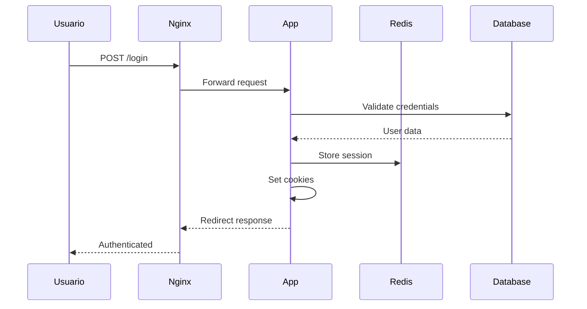
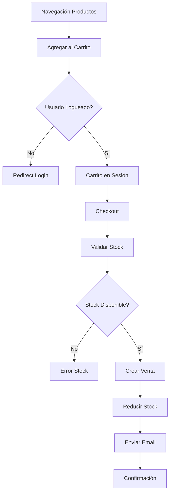

# 🏛️ Arquitectura del Sistema - Yagaruete Camp

## 📋 Descripción General

**Yagaruete Camp** es un sistema de e-commerce desarrollado siguiendo patrones arquitectónicos modernos y buenas prácticas de desarrollo. Utiliza el framework **CodeIgniter 4** con arquitectura **MVC** (Model-View-Controller) y está completamente dockerizado para facilitar el despliegue y escalabilidad.

## 🎯 Principios Arquitectónicos

### 1. **Separación de Responsabilidades**

- **Models**: Lógica de datos y business rules
- **Views**: Presentación e interfaz de usuario
- **Controllers**: Coordinación entre Models y Views

### 2. **Inversión de Dependencias**

- Uso de interfaces y abstracciones
- Dependency Injection nativo de CodeIgniter 4
- Servicios configurables

### 3. **Escalabilidad Horizontal**

- Arquitectura stateless
- Sesiones en Redis
- Base de datos independiente

### 4. **Containerización**

- Microservicios con Docker
- Orquestación con Docker Compose
- Environments aislados

## 🏗️ Arquitectura de Alto Nivel

```
┌─────────────────────────────────────────────────────────────────┐
│                        CLIENTE (Browser)                        │
└─────────────────────┬───────────────────────────────────────────┘
                      │ HTTP/HTTPS
                      │
┌─────────────────────▼───────────────────────────────────────────┐
│                     NGINX (Reverse Proxy)                       │
│                   - Load Balancing                              │
│                   - SSL Termination                             │
│                   - Static Files                                │
└─────────────────────┬───────────────────────────────────────────┘
                      │ FastCGI
                      │
┌─────────────────────▼───────────────────────────────────────────┐
│                   PHP-FPM (Application Layer)                   │
│                                                                 │
│  ┌─────────────────────────────────────────────────────────┐   │
│  │                 CODEIGNITER 4                           │   │
│  │                                                         │   │
│  │  ┌─────────────┐  ┌─────────────┐  ┌─────────────┐     │   │
│  │  │ Controllers │  │   Models    │  │    Views    │     │   │
│  │  │             │  │             │  │             │     │   │
│  │  │ • Auth      │  │ • Usuarios  │  │ • Frontend  │     │   │
│  │  │ • Productos │  │ • Productos │  │ • Backend   │     │   │
│  │  │ • Ventas    │  │ • Ventas    │  │ • Emails    │     │   │
│  │  │ • API       │  │ • Reportes  │  │ • PDF       │     │   │
│  │  └─────────────┘  └─────────────┘  └─────────────┘     │   │
│  │                                                         │   │
│  │  ┌─────────────┐  ┌─────────────┐  ┌─────────────┐     │   │
│  │  │ Filters     │  │ Libraries   │  │ Helpers     │     │   │
│  │  │             │  │             │  │             │     │   │
│  │  │ • Auth      │  │ • Email     │  │ • URL       │     │   │
│  │  │ • CORS      │  │ • PDF       │  │ • Form      │     │   │
│  │  │ • Rate Limit│  │ • Image     │  │ • Security  │     │   │
│  │  └─────────────┘  └─────────────┘  └─────────────┘     │   │
│  └─────────────────────────────────────────────────────────┘   │
└─────────────────────┬───────────────────────────────────────────┘
                      │
        ┌─────────────┼─────────────┐
        │             │             │
        ▼             ▼             ▼
┌─────────────┐ ┌─────────────┐ ┌─────────────┐
│   MySQL     │ │    Redis    │ │   MailHog   │
│             │ │             │ │             │
│ • yagaruete │ │ • Sessions  │ │ • SMTP Dev  │
│ • _camp     │ │ • Cache     │ │ • Mail UI   │
│ • _test     │ │ • Queue     │ │             │
└─────────────┘ └─────────────┘ └─────────────┘
```

## 🛠️ Stack Tecnológico

### Backend

- **Framework**: CodeIgniter 4.5+
- **PHP**: 8.2+ con extensiones optimizadas
- **Base de Datos**: MySQL 8.0
- **Cache**: Redis 7+
- **HTTP Server**: Nginx + PHP-FPM

### Frontend

- **HTML5** con semántica moderna
- **CSS3** + Bootstrap 5
- **JavaScript** vanilla + jQuery
- **DataTables** para tablas dinámicas
- **Font Awesome** para iconografía

### Infraestructura

- **Containerización**: Docker + Docker Compose
- **Orquestación**: Docker Swarm (producción)
- **Reverse Proxy**: Nginx
- **Process Management**: Supervisor

### Herramientas de Desarrollo

- **Email Testing**: MailHog
- **DB Management**: PHPMyAdmin
- **Debugging**: Xdebug
- **Logging**: Monolog
- **Testing**: PHPUnit

## 📁 Estructura del Proyecto

```
yagaruete-camp/
├── app/                          # Aplicación CodeIgniter 4
│   ├── Controllers/              # Controladores MVC
│   │   ├── BaseController.php    # Controlador base
│   │   ├── Home.php              # Página principal
│   │   ├── LoginController.php   # Autenticación
│   │   ├── ProductoController.php # Gestión de productos
│   │   ├── VentasController.php  # Gestión de ventas
│   │   └── API/                  # API REST endpoints
│   ├── Models/                   # Modelos de datos
│   │   ├── BaseModel.php         # Modelo base
│   │   ├── UsuariosModel.php     # Gestión de usuarios
│   │   ├── ProductoModel.php     # Gestión de productos
│   │   └── VentasCabeceraModel.php # Gestión de ventas
│   ├── Views/                    # Vistas y templates
│   │   ├── layouts/              # Layouts base
│   │   ├── front/                # Frontend público
│   │   ├── back/                 # Backend administrativo
│   │   └── emails/               # Templates de email
│   ├── Filters/                  # Filtros de autorización
│   │   ├── Auth.php              # Autenticación general
│   │   └── Cliente.php           # Filtro para clientes
│   ├── Config/                   # Configuraciones
│   │   ├── Routes.php            # Definición de rutas
│   │   ├── Database.php          # Configuración BD
│   │   ├── App.php               # Configuración app
│   │   └── Services.php          # Inyección dependencias
│   ├── Database/                 # Migraciones y Seeders
│   │   ├── Migrations/           # Esquemas de BD
│   │   └── Seeds/                # Datos iniciales
│   ├── Libraries/                # Librerías personalizadas
│   ├── Helpers/                  # Funciones auxiliares
│   └── Language/                 # Archivos de idioma
├── public/                       # Punto de entrada web
│   ├── index.php                 # Bootstrap de la aplicación
│   ├── assets/                   # Recursos estáticos
│   │   ├── css/                  # Estilos CSS
│   │   ├── js/                   # JavaScript
│   │   ├── images/               # Imágenes del sitio
│   │   └── uploads/              # Archivos subidos
│   └── favicon.ico               # Icono del sitio
├── writable/                     # Archivos escribibles
│   ├── cache/                    # Cache de aplicación
│   ├── logs/                     # Logs del sistema
│   ├── session/                  # Sesiones de archivo
│   └── uploads/                  # Uploads temporales
├── scripts/                      # Scripts de automatización
│   ├── setup/                    # Scripts de instalación
│   ├── maintenance/              # Scripts de mantenimiento
│   └── development/              # Scripts de desarrollo
├── docs/                         # Documentación técnica
├── docker/                       # Configuración Docker
│   ├── nginx/                    # Configuración Nginx
│   ├── php/                      # Configuración PHP
│   ├── mysql/                    # Configuración MySQL
│   └── redis/                    # Configuración Redis
├── tests/                        # Tests automatizados
├── vendor/                       # Dependencias Composer
└── docker-compose.yml            # Orquestación servicios
```

## 🔄 Flujo de Datos

### 1. **Request Lifecycle**

```
Usuario → Nginx → PHP-FPM → CodeIgniter → Controller → Model → Database
                                      ↓
Usuario ← Nginx ← PHP-FPM ← CodeIgniter ← View ← Controller ← Model
```

### 2. **Autenticación Flow**



### 3. **E-commerce Flow**



## 🔐 Seguridad

### Capas de Seguridad

#### 1. **Nginx Level**

```nginx
# Rate limiting
limit_req_zone $binary_remote_addr zone=login:10m rate=5r/m;

# Security headers
add_header X-Frame-Options SAMEORIGIN;
add_header X-Content-Type-Options nosniff;
add_header X-XSS-Protection "1; mode=block";
```

#### 2. **Application Level**

- **CSRF Protection**: Tokens en formularios
- **XSS Prevention**: Output escaping automático
- **SQL Injection**: Query Builder con parámetros
- **Session Security**: Regeneración de session ID

#### 3. **Authentication**

```php
// Multi-layer authentication
class AuthFilter implements FilterInterface
{
    public function before(RequestInterface $request)
    {
        // Verify session
        // Check user permissions
        // Validate CSRF token
        // Log access attempts
    }
}
```

### Manejo de Roles

```php
// Sistema de perfiles
const PERFIL_ADMIN = 1;
const PERFIL_CLIENTE = 2;

// Authorization middleware
if (!$this->hasPermission($user->perfil_id, $action)) {
    throw new UnauthorizedException();
}
```

## 📊 Gestión de Datos

### 1. **Data Access Layer**

```php
// Repository Pattern implementation
class ProductoRepository extends BaseModel
{
    protected $table = 'productos';
    protected $allowedFields = ['nombre', 'precio', 'stock'];

    public function getByCategory($categoryId)
    {
        return $this->where('categoria_id', $categoryId)
                   ->where('activo', 1)
                   ->findAll();
    }
}
```

### 2. **Caching Strategy**

```php
// Multi-level caching
class CacheService
{
    public function getProduct($id)
    {
        // L1: Memory cache (APCu)
        $product = apcu_fetch("product_{$id}");

        if (!$product) {
            // L2: Redis cache
            $product = $this->redis->get("product_{$id}");

            if (!$product) {
                // L3: Database
                $product = $this->productModel->find($id);
                $this->redis->setex("product_{$id}", 3600, $product);
            }

            apcu_store("product_{$id}", $product, 300);
        }

        return $product;
    }
}
```

### 3. **Database Transactions**

```php
// ACID transactions
public function createSale($userId, $items)
{
    $this->db->transStart();

    try {
        // Create sale header
        $saleId = $this->ventasModel->insert($saleData);

        // Create sale details and update stock
        foreach ($items as $item) {
            $this->ventasDetalleModel->insert($detailData);
            $this->productModel->updateStock($item['id'], -$item['quantity']);
        }

        $this->db->transComplete();

        if ($this->db->transStatus() === false) {
            throw new Exception('Transaction failed');
        }

        return $saleId;
    } catch (Exception $e) {
        $this->db->transRollback();
        throw $e;
    }
}
```

## 🚀 Performance y Escalabilidad

### 1. **Optimizaciones de Aplicación**

```php
// Lazy loading
class ProductController extends BaseController
{
    public function index()
    {
        // Paginated results
        $products = $this->productModel
            ->select('id, nombre, precio, imagen')
            ->where('activo', 1)
            ->paginate(20);

        return view('products/index', compact('products'));
    }
}

// Eager loading relationships
$sales = $this->ventasModel
    ->select('ventas_cabecera.*, usuarios.nombre as cliente')
    ->join('usuarios', 'usuarios.id = ventas_cabecera.usuario_id')
    ->findAll();
```

### 2. **Asset Optimization**

```javascript
// JavaScript optimization
(function () {
  "use strict";

  // Lazy load images
  const lazyImages = document.querySelectorAll("img[data-src]");
  const imageObserver = new IntersectionObserver((entries) => {
    entries.forEach((entry) => {
      if (entry.isIntersecting) {
        const img = entry.target;
        img.src = img.dataset.src;
        img.removeAttribute("data-src");
        imageObserver.unobserve(img);
      }
    });
  });

  lazyImages.forEach((img) => imageObserver.observe(img));
})();
```

### 3. **Database Optimization**

```sql
-- Query optimization
EXPLAIN SELECT
    p.nombre, p.precio, c.nombre as categoria
FROM productos p
INNER JOIN categorias c ON p.categoria_id = c.id
WHERE p.activo = 1
    AND p.stock > 0
ORDER BY p.nombre
LIMIT 20;

-- Index optimization
CREATE INDEX idx_productos_activo_stock ON productos(activo, stock);
CREATE FULLTEXT INDEX idx_productos_search ON productos(nombre, descripcion);
```

## 🔄 Deployment Pipeline

### 1. **Development**

```bash
# Local development with hot reload
docker-compose up -d
./scripts/setup/init-database.sh
./scripts/maintenance/healthcheck.sh
```

### 2. **Staging**

```bash
# Staging deployment
docker-compose -f docker-compose.staging.yml up -d
./scripts/maintenance/backup.sh --name "pre-staging"
./scripts/setup/deploy.sh restart
```

### 3. **Production**

```bash
# Production deployment with zero downtime
docker stack deploy -c docker-compose.prod.yml yagaruete-camp
./scripts/maintenance/healthcheck.sh --verbose
./scripts/maintenance/verify-data.php
```

## 📈 Monitoring y Logging

### Application Logging

```php
// Structured logging
log_message('info', 'User login attempt', [
    'user_id' => $userId,
    'ip' => $this->request->getIPAddress(),
    'user_agent' => $this->request->getUserAgent(),
    'timestamp' => time()
]);

// Performance logging
$startTime = microtime(true);
// ... operation
$duration = microtime(true) - $startTime;
log_message('debug', "Operation completed in {$duration}s");
```

### Health Checks

```bash
# Automated health monitoring
./scripts/maintenance/healthcheck.sh --verbose > /var/log/health.log

# Data integrity checks
./scripts/maintenance/verify-data.php >> /var/log/integrity.log
```

## 🧪 Testing Strategy

### Unit Tests

```php
class ProductModelTest extends TestCase
{
    public function testCreateProduct()
    {
        $product = $this->productModel->create([
            'nombre' => 'Test Product',
            'precio' => 100.00,
            'stock' => 10
        ]);

        $this->assertIsNumeric($product);
        $this->assertDatabaseHas('productos', [
            'nombre' => 'Test Product'
        ]);
    }
}
```

### Integration Tests

```bash
# Automated testing
docker-compose exec app vendor/bin/phpunit
./scripts/maintenance/healthcheck.sh
curl -f http://localhost:8080/health || exit 1
```

## 📚 Patrones Implementados

### 1. **MVC (Model-View-Controller)**

- Separación clara de responsabilidades
- Controllers delgados, Models robustos
- Views sin lógica de negocio

### 2. **Repository Pattern**

- Abstracción del acceso a datos
- Facilita testing y mantenimiento
- Interfaces consistentes

### 3. **Filter Pattern**

- Middleware para cross-cutting concerns
- Autenticación, autorización, logging
- Pipeline de procesamiento

### 4. **Service Layer**

- Lógica de negocio centralizada
- Reutilización entre controllers
- Transacciones y validaciones

## 🔮 Roadmap Técnico

### Fase 1: Core Features ✅

- [x] Sistema de autenticación
- [x] CRUD de productos
- [x] Carrito de compras
- [x] Sistema de ventas

### Fase 2: Enhancement 🔄

- [ ] API REST completa
- [ ] Sistema de notificaciones
- [ ] Reportes avanzados
- [ ] Cache distribuido

### Fase 3: Scale 📈

- [ ] Microservicios
- [ ] Event sourcing
- [ ] CI/CD pipeline
- [ ] Monitoring avanzado

---

**Yagaruete Camp** - Arquitectura moderna y escalable para e-commerce 🏛️
